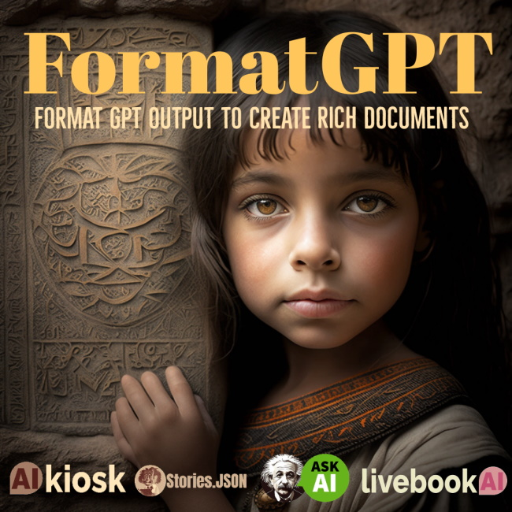

# Stories.JSON


Stories.JSON is an open source format for composing, running and scheduling formatted output for large language models such as Gemini, xAI, GPT and others. Created by [Kevin Ashley Labs](http://kevinashley.com) and used by [AI Coaching](https://aicoaching.us), [Livebook AI](https://livebookai.com) and many other applications.

[Example Stories.JSON](/src/examples/stories.json)

## Stories.JSON Python Library

The Python libary and API for processing Stories.JSON is available for commercial licensing. Please contact [Kevin Ashley](https://www.linkedin.com/in/kashlik/). 

## Showcases

Stories.JSON is used in the following projects:

 - [Livebook AI](https://livebookai.com/category) - AI Stories Platform

 - [AI Kiosk](https://livebookai.com/post/kiosk) at the Computer History Museum

## Guide to Stories.JSON

Stories.JSON is a template format used by Stories.JSON composition engine (also known as FormatGPT).
Stories.JSON templates are scripts for story structures, enabling Large Language Models (LLMs) to compose large texts, for example articles, books, novels etc.
From Aristotle, with his concept of beginning, middle and end, or 3 acts structure, to various structures used today to write blogs, technical articles etc, Stories.JSON allows you to create flexible structures for your content and avoid large scale models limitations on size of produced text and limited inference "memory", which for GPT-3 was 2048 tokens.
Without a composition engine like Stories.JSON FormatGPT, large scale models can only produce short text fragments, usually without a strong logical connection. FormatGPT also makes possible formatting and writing rich documents that include elements outside of NLP, such as images etc.

Let's look at a template for a [professional article](/src/examples/stories.json) and [prompt definitions](src/examples/professional-article/). 

```json
"professional-article" : [
        {"args": {
            "template_name": "professional-article",
            "display_name": "Business and Professional",
            "$category": "$category",
            "category_filter": "(Business and Professional)",
            "$number": 6,
            "usage_chars": 0,
            "parts" : [],
            "similarity": 0.0,
            "min_length_blocks": 7
            }
        },
        {"prompt": "plot", "args": ["$category", "$number"], "run":"once"},
        {"prompt": "title", "args": ["$category", "$plot"], "format":"h:1", "run":"once", "limit":80, "type": "title"},
        {"prompt": "concise_summary", "args": ["$category", "$title", "$plot"], "run":"once"},
        {"prompt": "introduction", "args": ["$category", "$title", "$concise_summary"], "run":"once", "format":"paragraph" },
        {"section": "facts", "repeat":"$number", "steps":
            [
                { "prompt": "fact_title", "args": ["$plot", "$index"], "format":"h:3", "type": "title"},
                { "prompt": "fact", "args": ["$category", "$fact_title", "$plot", "$index"], "format":"paragraph"}
            ]
        },
        {"prompt": "conclusion", "args": ["$category", "$title", "$plot"], "run":"once", "format":"paragraph" }
    ]
```

As you can see, the template contains several sections.
Stories.JSON is dictionary, containing multiple templates uniquely identified by name.

## Getting started with Stories.JSON 

Aristotle's three acts structure can be easily modeled with Stories.JSON, as well as many other composition types. To write great story structures, you can start with pre-built templates in FormatGPT directory.

- interesting-facts is great for popular stories
- professional-article writes multi-title story structure
- live is used for fiction 3 acts structure
- poetry is a poetry specific template
- recipe can write recipes
- interview problem template provides 

You can create templates that generate text, images, code and richly formatted text output.

For example, problems created for my book [Interview with Artificial Intelligence](https://www.amazon.com/dp/B0BNV3MN53) are defined in Stories.JSON [interview-problem](/src/examples/stories.json) template.

## Variables

There're two types of variables in templates: the ones marked by $ are used for prompt substitutions. Prompts are used to provide inputs to the models. For example, a variable $title is used to define a title, it is also likely to be used in prompts. For example:

```text
Write an introduction for the article titled "$title" in "$category" category summarized below. The introduction has to be long enough, at least several paragraphs, and compelling to grab readers' attention and pull them in.

Summary:
'''
$concise_summary
'''

Long introduction
```

## Prompts

In the prompt example above there're several substitute variables: $title, $category, $concise_summary.
Prompts are placed inside the template folder and are simple text files with substitute variables.

```text
autowriter/
 template-folder/
  models
   plot.json <-- model parameters
   title.json
  plot.txt <-- prompts
  title.txt
...
```

An example of a parameterized plot, notice substitute variables $category, $title and $concise_summary in the prompt:

```
Write an introduction for the article titled "$title" in "$category" category summarized below. The introduction has to be long enough, at least several paragraphs, and compelling to grab readers' attention and pull them in.

Summary:
'''
$concise_summary
'''

Long introduction:
```

## Template Arguments

Each template contains an args section that includes input parameters. As the FormatGPT engine runs the template, it adds new values to the args section.

```json

 {"args": {
            "template_name": "professional-article",
            "display_name": "Business and Professional",
            "$category": "$category",
            "category_filter": "(Business and Professional)",
            "$number": 6,
            "usage_chars": 0,
            "parts" : [],
            "similarity": 0.0,
            "min_length_blocks": 7
            }
        }
```

## Special Parameters

There're several parameters that are very useful for any text generation, so FormatGPT will always produce the following:

- $title - the title of the story as it appears on LivebookAI 
- $category - this is important for categorization of the stories using standard format for book categories, e.g. Fiction / Romance / Historical or Business / Technology / Artificial Intelligence.
- $plot - plot is often hidden from the site, but is always used as a concise outline of the whole story
- $concise_summary - this is an "abstract" of your story

It's important that initially you may not have those variables, but as the template runs, FormatGPT will fill them for you if you don't specify them in the input.

## Template Execution

Template execution begins with args section, which sets input parameters, and executes steps sequentially. Loops and repetitions are allowed. Templates are persisted with each step, providing a "restart" capability for steps at any point. For example, look at the first step after args in the template above:

```json
{"prompt": "plot", "args": ["$category", "$number"], "run":"once"},
```

The step starts with prompt parameter which defines the prompt. The name of the prompt is plot "prompt": "plot", notice that we don't have $plot in Args section, so FormatGPT loads prompt file named plot.txt from the template directory, makes known parameters substitutions  "args": ["$category", "$number"] from the args section of the template and runs the model.
Model parameters are stored as json files in models/ folder in the template folder, so FormatGPT will use models/plot.json as parameters file for the model call.
There's also a parameter "run":"once" which means that this step will only run once and will not rerun as FormatGPT picks the template. This is important to avoid repetitions when template is scheduled.

## Prompt step

Prompts are core to AI inference. FormatGPT's prompt step includes rich methods that substitute prompt parameters at run time, store variables and prevent running over the budget of tokens.
If you look at the plot.txt file for the plot, you'll see that it uses both arguments defined in template steps: $category and $number. And the plot will produce 6 topics ($number = 6 in the Args section above).

```text
For an article in "$category" category, think of a subject, then write $number outline topics, including a topic for a problem statement and a solution.

Topics:
```

Now comes the exciting part, FormatGPT calls AI model in this step, but where's the result? The result is saved in the "$plot" variable, notice the $ sign, and added to args. FormatGPT also copies it into $prev variable which is helpful in the next steps.

## Model Output 

The model output for each step is saved in the variable with the name of the prompt. So prompt named "plot" will store the output in "$plot" variable in "args" section of the template. In addition, FormatGPT also copies the last prompt output to "$prev" variable. This becomes very useful in the next steps to refer to results of previous steps.
Our template initially had two variables defined in args section: "$category" and "$number". Now after FormatGPT call to AI model, we have "$plot" result.

## Example: Generate Title

Now we have $category, $plot variables defined, i.e. in the previous steps FormatGPT filled their values either from input arguments or by calling AI model ($plot), so FormatGPT moves to the next step to generate $title.
Our input parameters for this step are "args": ["$category", "$plot"]. $category was defined in the input args, but plot was just freshly generated by AI model. And we're using it to make a title.

```json
"prompt": "title", "args": ["$category", "$plot"], "format":"h:1", "run":"once", "limit":80, "type": "title"}
```

Notice that title step has a few new parameters:

- "format":"h:1" - this tells FormatGPT that the result of this step should be added to the output text of our story and formatted as a Header of the first level
- "limit":80 - tells FormatGPT to limit the title to 80 characters

Note: If you want to limit the size of the prompt output, use an appropriate max_tokens value in the model JSON. This prevents AI model from producing large output, limit will only limit the output result by word boundaries:

```json
{
    "engine": "text-davinci-002",
    "temperature": 0.7,
    "max_tokens": 18,
    "top_p": 1.0,
    "frequency_penalty": 0,
    "presence_penalty": 0,
    "stop_sequence": ["Topics:", "Concise title:"] 
}
```

In the above example title.json max_tokens is set to 18, or roughly 72 characters, still models can return more characters to "limit" puts a hard limit to that.


## Formatted Output

FormatGPT was designed to produce richly formatted output, including titles, lists, images, code and more. To tell FormatGPT that you want the step to format the output include "format" in the step. Valid values are:

- h:N - header N = level, i.e. 1-6
- paragraph - format output as paragraph
- code - format output as code 
- recipe - especially formatted recipe

## Loops and Repetitions

What if we need to call the same step multiple times?
While FormatGPT is not recursive, it allows loop sections.

```json
{"section": "facts", "repeat":"$number", "steps":
            [
                { "prompt": "fact_title", "args": ["$plot", "$index"], "format":"h:3", "type": "title"},
                { "prompt": "fact", "args": ["$category", "$fact_title", "$plot", "$index"], "format":"paragraph"}
            ]
        }
```

In this section, called "facts" we make use of "repeat":"$number" variable, remember that our number = 6 and we used it earlier to create topics for our plot. 
This section has 2 sub steps: fact_title and fact. So, FormatGPT executes these steps and repeats the section until it exceeds $number times.

Loops are very useful if you want to generate long text.

## Scheduler

LivebookAI can schedule templates, that typically involves running a subset of template steps, usually $title, $plot and $concise_summary. When the template is scheduled, you have an advantage of seeing the future publication, including title, plot and abstract. The partially executed template JSON is stored in the database and later retrieved when the template completes.

## Content step - producing formatted content

In addition to "format" tag in prompt steps, there's also a dedicated content step that produces a formatted output. The following content step produces a custom title:

```json
{ "content": "Nutrition Facts:", "format":"h:5"}
```

Please, see format specification above for valid values.

## Inserting Delimiters in Output

A special case for a content tag is a delimiter. It’s frequently used in poetry or books to separate sections:

```json
{"content": "***", "format":"delimiter"}
```

## Set step - assigning variable values

The set step allows you to set a variable to another variable:

```json
{"set": "$prev", "value": "$rising_action"}
```

This may be useful to copy values.

## Lastlines suffix - limiting text size to the last few lines

One of the problems with LLMs is the limited size of the prompt. To limit the size of the variable sebt to the prompt, use .lastlines variable suffix, e.g $prev.last_lines:

```json
{ "prompt": "summary", "args": ["$category", "$title", "$summary", "$prev.last_lines"]}
```

## Inline variable assignment 

Occasionally you need to set the variable inline, without a separate set step. To do so, use : operator, e.g $summary:$prev will set $summary variable to the current value of $prev:

```json
{"prompt": "summary", "args": ["$category", "$title", "$summary:$prev", "$prev.last_lines"]}
```


## FormatGPT

Python library and API for FormatGPT and Stories.JSON is available for commercial licensing. How to use:

- As a standalone Python library - include in your code 
- As a Docker container service - use as container (moderate development)
- As a multi-tenant API service - get API key and access (minimum development)

Please contact [Kevin Ashley](https://www.linkedin.com/in/kashlik/) for details of integration into your project.

[](http://FormatGPT.com)


